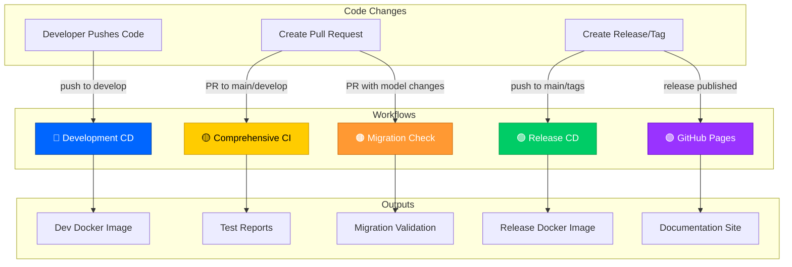
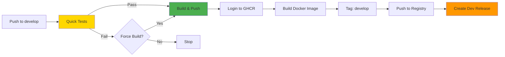
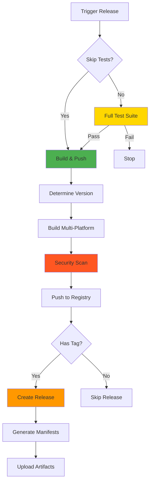
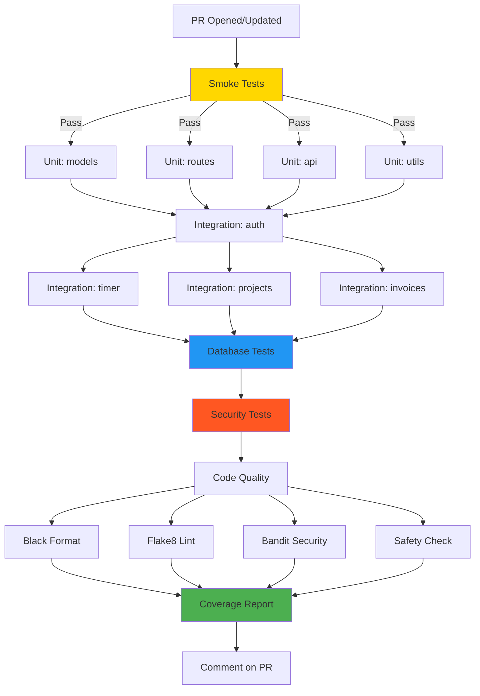
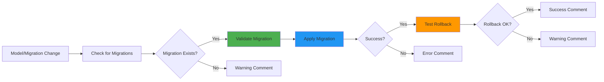
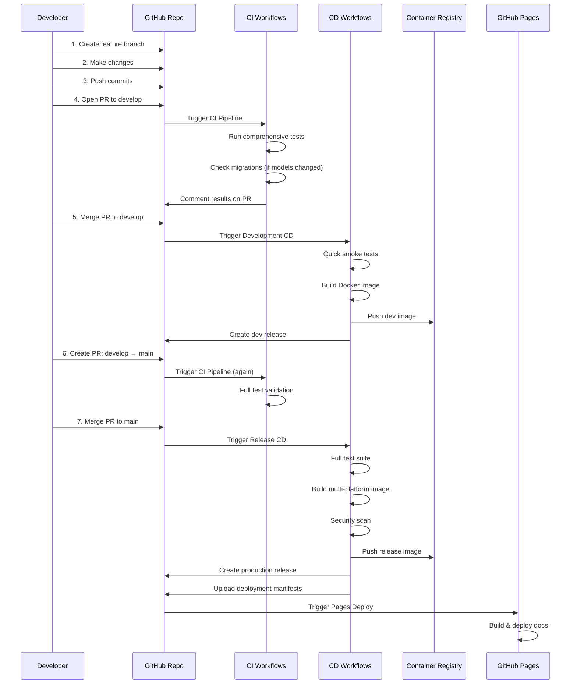

# 🏗️ TimeTracker CI/CD Workflow Architecture

> Complete visual guide to the GitHub Actions pipeline system

---

## 📊 **High-Level Overview**



---

## 🔵 **1. Development CD Workflow**

**File:** `.github/workflows/cd-development.yml`

### **Triggers:**
- ✅ Push to `develop` branch (automatic)
- 🔘 Manual trigger via workflow_dispatch (with force build option)

### **Flow Diagram:**



### **Jobs:**

#### **Job 1: quick-tests** ⚡
```yaml
Duration: ~2-5 minutes
Runs: Smoke tests only
Services: PostgreSQL 16
Purpose: Fast feedback for developers
```

**Steps:**
1. 📥 Checkout code
2. 🐍 Set up Python 3.11
3. 📦 Install dependencies (cached)
4. 🧪 Run smoke tests (`pytest -m smoke`)

#### **Job 2: build-and-push** 🐳
```yaml
Duration: ~10-15 minutes
Depends on: quick-tests (or force_build)
Purpose: Create development Docker image
```

**Steps:**
1. 📥 Checkout code (full history)
2. 🐳 Set up Docker Buildx
3. 🔐 Login to GHCR (ghcr.io)
4. 🏷️ Extract metadata (tags & labels)
5. 🔨 Build & push Docker image
   - Tag: `develop`
   - Tag: `dev-YYYYMMDD-HHMMSS`
   - Tag: `dev-{commit_sha}`
6. 📋 Generate changelog
7. 🎉 Create GitHub Release
   - Name: `Development Build - {timestamp}`
   - Tag: `dev-{timestamp}`
   - Pre-release: true

### **Outputs:**
- 🐳 Docker Images:
  - `ghcr.io/drytrix/timetracker:develop`
  - `ghcr.io/drytrix/timetracker:dev-20251010-120000`
  - `ghcr.io/drytrix/timetracker:dev-abc1234`
- 📦 GitHub Release (pre-release, auto-generated)

### **Permissions:**
```yaml
permissions: write-all
```
✅ Full access to contents, packages, releases

---

## 🟢 **2. Release CD Workflow**

**File:** `.github/workflows/cd-release.yml`

### **Triggers:**
- ✅ Push to `main` or `master` branch
- 🏷️ Push version tags (`v*.*.*`)
- 🎉 Release published
- 🔘 Manual trigger (with version input)

### **Flow Diagram:**



### **Jobs:**

#### **Job 1: full-test-suite** 🧪
```yaml
Duration: ~15-25 minutes
Runs: ALL tests with coverage
Services: PostgreSQL 16
Skippable: via skip_tests input
```

**Tests Include:**
- ✅ Smoke tests
- ✅ Unit tests
- ✅ Integration tests
- ✅ Security tests
- ✅ API tests
- ✅ Database tests
- 📊 Coverage reports (Codecov)
- 📋 Test result publishing

#### **Job 2: build-and-push** 🐳
```yaml
Duration: ~20-30 minutes
Depends on: full-test-suite (if not skipped)
Builds: Multi-platform (amd64, arm64)
```

**Steps:**
1. 📥 Checkout code
2. 🔍 Determine version (from tag or input)
3. 🐳 Set up Docker Buildx (multi-platform)
4. 🔐 Login to GHCR
5. 🏷️ Extract metadata
6. 🔨 Build & push multi-platform images
   - Platforms: `linux/amd64`, `linux/arm64`
   - Tag: `latest`
   - Tag: `v{version}` (e.g., `v1.2.3`)
   - Tag: `{major}.{minor}` (e.g., `1.2`)
7. 🔒 Run security scan (Trivy)
8. 📊 Upload scan results

#### **Job 3: create-release** 🎉
```yaml
Duration: ~2-5 minutes
Depends on: build-and-push
Runs: Only if triggered by tag
```

**Steps:**
1. 📥 Checkout code
2. 📋 Generate changelog
3. 🎉 Create GitHub Release
   - Name: `Release {version}`
   - Tag: `v{version}`
   - Changelog included
   - NOT a pre-release

#### **Job 4: generate-deployment-manifests** 📦
```yaml
Duration: ~1-2 minutes
Depends on: create-release
Purpose: Generate K8s/Docker deployment files
```

**Generates:**
- `docker-compose.prod.yml` - Docker Compose config
- `kubernetes-deployment.yml` - K8s deployment
- `kubernetes-service.yml` - K8s service
- `values.yaml` - Helm values

### **Outputs:**
- 🐳 Docker Images (multi-platform):
  - `ghcr.io/drytrix/timetracker:latest`
  - `ghcr.io/drytrix/timetracker:v1.2.3`
  - `ghcr.io/drytrix/timetracker:1.2`
- 📦 GitHub Release (production)
- 📄 Deployment manifests (artifacts)
- 🔒 Security scan reports

### **Permissions:**
```yaml
Job 1: None (tests only)
Job 2: packages: write, contents: read
Job 3: contents: write
Job 4: None (manifest generation)
```

---

## 🟡 **3. Comprehensive CI Workflow**

**File:** `.github/workflows/ci-comprehensive.yml`

### **Triggers:**
- 🔀 Pull requests to `main` or `develop`

### **Flow Diagram:**



### **Jobs:**

#### **Job 1: smoke-tests** ⚡ (~5 min)
Fast critical tests for immediate feedback

#### **Job 2: unit-tests** 🧩 (~10 min)
Parallel matrix testing:
- `models` - User, Client, Project, TimeEntry, Invoice, Task
- `routes` - Page routes, navigation
- `api` - API endpoints
- `utils` - Helper functions

#### **Job 3: integration-tests** 🔗 (~15 min)
Parallel matrix testing:
- `auth` - Login, logout, permissions
- `timer` - Start/stop timer, time tracking
- `projects` - Project CRUD, relationships
- `invoices` - Invoice generation, PDF export

#### **Job 4: database-tests** 🗄️ (~10 min)
- Schema validation
- Migrations
- Relationships
- Constraints

#### **Job 5: security-tests** 🔒 (~8 min)
- Authentication checks
- Authorization rules
- CSRF protection
- XSS prevention
- SQL injection prevention

#### **Job 6: code-quality** 🎨 (~5 min)
Parallel checks:
- **Black** - Code formatting
- **Flake8** - Style & error checking
- **Bandit** - Security vulnerabilities
- **Safety** - Dependency vulnerabilities

#### **Job 7: coverage-report** 📊 (~2 min)
- Aggregate all coverage data
- Generate unified report
- Comment coverage % on PR
- Upload to Codecov

### **Outputs:**
- 📊 Test results (artifacts)
- 📈 Coverage reports (Codecov)
- 💬 PR comments with results
- 🏷️ Status checks on PR

### **Permissions:**
```yaml
coverage-report job:
  contents: read
  pull-requests: write
  issues: write
```

---

## 🟠 **4. Migration Check Workflow**

**File:** `.github/workflows/migration-check.yml`

### **Triggers:**
- 🔀 Pull requests that modify:
  - `app/models/**`
  - `migrations/**`
  - `requirements.txt`
- ✅ Push to `main` with same paths

### **Flow Diagram:**



### **Jobs:**

#### **Job 1: validate-migrations** 🔍
```yaml
Duration: ~5-8 minutes
Services: PostgreSQL 16
Purpose: Ensure migrations are safe
```

**Steps:**
1. 📥 Checkout code (full history)
2. 🐍 Set up Python 3.11
3. 📦 Install dependencies
4. 🔍 Check for migration changes
5. ✅ Validate migration syntax
6. 🔨 Apply migrations (test DB)
7. ↩️ Test rollback
8. 📋 Generate migration report
9. 🧪 Run migration tests

#### **Job 2: comment-on-pr** 💬
```yaml
Duration: ~1 minute
Depends on: validate-migrations
Runs: Only on PRs
```

**Comments Include:**
- ✅ Migration validation status
- 📊 Schema changes detected
- ⚠️ Warnings (if any)
- 🔍 Review checklist

### **Outputs:**
- 💬 PR comments with migration status
- 📋 Migration validation report
- 🏷️ Status checks

### **Permissions:**
```yaml
Job 1: None (validation only)
Job 2: 
  contents: read
  pull-requests: write
  issues: write
```

---

## 🟣 **5. GitHub Pages Workflow**

**File:** `.github/workflows/static.yml`

### **Triggers:**
- 🎉 Release published

### **Flow Diagram:**


### **Jobs:**

#### **Job 1: build** 🔨
```yaml
Duration: ~2 minutes
Purpose: Prepare site content
```

**Steps:**
1. 📥 Checkout code
2. ⚙️ Setup Pages configuration
3. 📦 Upload repository as artifact

#### **Job 2: deploy** 🚀
```yaml
Duration: ~1 minute
Depends on: build
Environment: github-pages
```

**Steps:**
1. 🌐 Deploy to GitHub Pages

### **Outputs:**
- 🌐 Live documentation site
- 📄 URL: `https://drytrix.github.io/TimeTracker/`

### **Permissions:**
```yaml
permissions:
  contents: read
  pages: write
  id-token: write
```

---

## 🔄 **Complete Development Cycle**



---

## 📋 **Workflow Comparison**

| Feature | Development CD | Release CD | Comprehensive CI | Migration Check | GitHub Pages |
|---------|---------------|------------|------------------|----------------|--------------|
| **Trigger** | Push to `develop` | Push to `main`/tags | Pull requests | Model changes | Release published |
| **Test Level** | Smoke only | Full suite | All tests | Migration tests | None |
| **Duration** | ~5-10 min | ~40-60 min | ~30-45 min | ~5-10 min | ~3 min |
| **Docker Build** | ✅ Single platform | ✅ Multi-platform | ❌ No | ❌ No | ❌ No |
| **Security Scan** | ❌ No | ✅ Trivy | ✅ Bandit | ❌ No | ❌ No |
| **Coverage** | ❌ Disabled | ✅ Full | ✅ Full | ❌ N/A | ❌ N/A |
| **Release Created** | ✅ Pre-release | ✅ Production | ❌ No | ❌ No | ❌ No |
| **PR Comments** | ❌ No | ❌ No | ✅ Yes | ✅ Yes | ❌ No |
| **Artifacts** | Docker image | Docker + Manifests | Test reports | Migration report | Documentation |

---

## 🎯 **Key Features**

### **1. Fast Feedback Loop** ⚡
- Smoke tests run in ~5 minutes
- Parallel test execution
- Early failure detection

### **2. Comprehensive Coverage** 📊
- 137 tests across all layers
- Unit, integration, security tests
- Database and migration validation

### **3. Security First** 🔒
- Code scanning (Bandit)
- Dependency scanning (Safety)
- Container scanning (Trivy)
- Authentication/authorization tests

### **4. Multi-Platform Support** 🌍
- Linux amd64 (Intel/AMD)
- Linux arm64 (Apple Silicon, ARM servers)

### **5. Developer Experience** 👨‍💻
- PR comments with test results
- Coverage reports on every PR
- Migration validation warnings
- Force build option for emergencies

### **6. Production Ready** 🚀
- Full test suite before release
- Security scanning
- Deployment manifests auto-generated
- GitHub Pages documentation

---

## 📊 **Test Coverage Breakdown**

```yaml
Total Tests: 137

By Type:
  - Smoke Tests: 13 (critical paths)
  - Unit Tests: 40+ (models, utils)
  - Integration Tests: 30+ (routes, API)
  - Security Tests: 25+ (auth, XSS, CSRF)
  - Database Tests: 15+ (schema, migrations)
  - API Tests: 14+ (endpoints)

By Marker:
  - @pytest.mark.smoke: 13
  - @pytest.mark.unit: 40
  - @pytest.mark.integration: 30
  - @pytest.mark.security: 25
  - @pytest.mark.database: 15
  - @pytest.mark.api: 14
  - @pytest.mark.models: 20
  - @pytest.mark.routes: 18
```

---

## 🔐 **Permissions Summary**

| Workflow | Workflow Level | Job Level | Purpose |
|----------|----------------|-----------|---------|
| **cd-development.yml** | `write-all` | Inherited | Full access for releases |
| **cd-release.yml** | None | Per-job | Least privilege per job |
| **ci-comprehensive.yml** | None | Coverage job only | PR comments |
| **migration-check.yml** | None | Comment job only | PR comments |
| **static.yml** | Pages + ID token | Inherited | GitHub Pages deploy |

---

## 🚀 **Next Steps After Workflow Runs**

### **After Development CD:**
1. ✅ Check dev release created
2. 🐳 Pull dev image: `docker pull ghcr.io/drytrix/timetracker:develop`
3. 🧪 Test in dev environment
4. ✅ Verify functionality

### **After Release CD:**
1. ✅ Check production release created
2. 📦 Download deployment manifests
3. 🐳 Pull release image: `docker pull ghcr.io/drytrix/timetracker:latest`
4. 🚀 Deploy to production using manifests
5. 📚 Check GitHub Pages updated

### **After PR CI:**
1. 📊 Review test results in PR comments
2. 📈 Check coverage report
3. ⚠️ Address any warnings
4. 🔍 Review migration validation (if applicable)
5. ✅ Merge when all checks pass

---

## 🎉 **Success Criteria**

All workflows should show:
- ✅ All jobs completed successfully
- ✅ No security vulnerabilities found
- ✅ Test coverage ≥ 50% (for full runs)
- ✅ All code quality checks passed
- ✅ Docker images pushed to GHCR
- ✅ Releases created with proper tags
- ✅ PR comments posted (for CI)

---

## 📞 **Monitoring & Debugging**

### **Check Workflow Status:**
```
GitHub → Actions tab
```

### **View Logs:**
```
Actions → Select workflow run → Select job → View logs
```

### **Common Issues:**

1. **Tests Failing:**
   - Check test logs
   - Run locally: `pytest -v`
   - Check database connections

2. **Docker Build Failing:**
   - Check Dockerfile syntax
   - Verify dependencies in requirements.txt
   - Check for file permissions

3. **Release Creation Failing:**
   - Verify permissions are `write-all`
   - Check repository settings
   - Ensure tags are unique

4. **Coverage Below Threshold:**
   - Add more tests
   - Or disable coverage check for dev: `--no-cov`

---

## 📚 **Related Documentation**

- [GitHub Actions Documentation](https://docs.github.com/en/actions)
- [Pytest Documentation](https://docs.pytest.org/)
- [Docker Documentation](https://docs.docker.com/)
- [GitHub Container Registry](https://docs.github.com/en/packages/working-with-a-github-packages-registry/working-with-the-container-registry)

---

**Last Updated:** October 10, 2025  
**Version:** 1.0.0  
**Status:** ✅ All workflows operational

