# TimeTracker

<div align="center">

### Professional Time Tracking & Project Management for Teams

**Track time. Manage projects. Generate invoices. All in one place.**

[🚀 Quick Start](#-quick-start) • [✨ Features](#-features) • [📸 Screenshots](#-screenshots) • [📖 Getting Started](docs/GETTING_STARTED.md) • [📚 Documentation](docs/) • [🐳 Deploy](#-deployment)

---

</div>

## 🎯 What is TimeTracker?

TimeTracker is a **self-hosted, web-based time tracking application** designed for freelancers, teams, and businesses who need professional time management with complete control over their data.

**Perfect for:**
- 💼 **Freelancers** tracking billable hours across multiple clients
- 👥 **Small Teams** managing projects and tracking productivity
- 🏢 **Agencies** needing detailed reporting and client billing
- 🔒 **Privacy-focused organizations** wanting self-hosted solutions

---

## ✨ Features

### ⏱️ **Smart Time Tracking**
- **One-Click Timers** — Start tracking with a single click
- **Persistent Timers** — Timers keep running even after browser closes
- **Idle Detection** — Automatic pause after configurable idle time
- **Manual Entry** — Add historical time entries with notes and tags
- **Real-time Updates** — See live timer updates across all devices

### 📊 **Project & Task Management**
- **Unlimited Projects & Tasks** — Organize work your way
- **Client Management** — Store client details and billing rates
- **Task Board** — Visual task management with priorities and assignments
- **Status Tracking** — Monitor progress from to-do to completion
- **Estimates vs Actuals** — Track project budgets and burn rates

### 🧾 **Professional Invoicing**
- **Generate from Time** — Convert tracked hours to invoices automatically
- **Custom Line Items** — Add manual items for expenses or services
- **Tax Calculation** — Automatic tax calculations with configurable rates
- **PDF Export** — Professional invoice templates (coming soon)
- **Status Tracking** — Track draft, sent, paid, and overdue invoices

### 📈 **Analytics & Reporting**
- **Visual Dashboards** — Charts and graphs for quick insights
- **Detailed Reports** — Time breakdown by project, user, or date range
- **CSV Export** — Export data for external analysis
- **Billable vs Non-billable** — Separate tracking for accurate billing
- **Custom Date Ranges** — Flexible reporting periods

### 🔐 **Multi-User & Security**
- **Role-Based Access** — Admin and user roles with appropriate permissions
- **User Management** — Add team members and manage access
- **Self-Hosted** — Complete control over your data
- **Username-Only Login** — Simple authentication for internal use
- **Session Management** — Secure cookies and session handling

### 🛠️ **Technical Excellence**
- **Docker Ready** — Deploy in minutes with Docker Compose
- **Database Flexibility** — PostgreSQL for production, SQLite for testing
- **Responsive Design** — Works perfectly on desktop, tablet, and mobile
- **Real-time Sync** — WebSocket support for live updates
- **Automatic Backups** — Scheduled database backups (configurable)

---

## 📸 Screenshots

<div align="center">

### Dashboard — Your Command Center
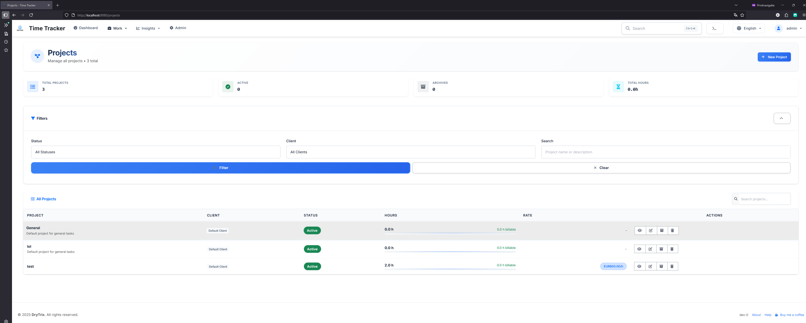

*Start timers, view recent entries, and see your productivity at a glance*

---

### Projects & Tasks — Stay Organized
<div>
  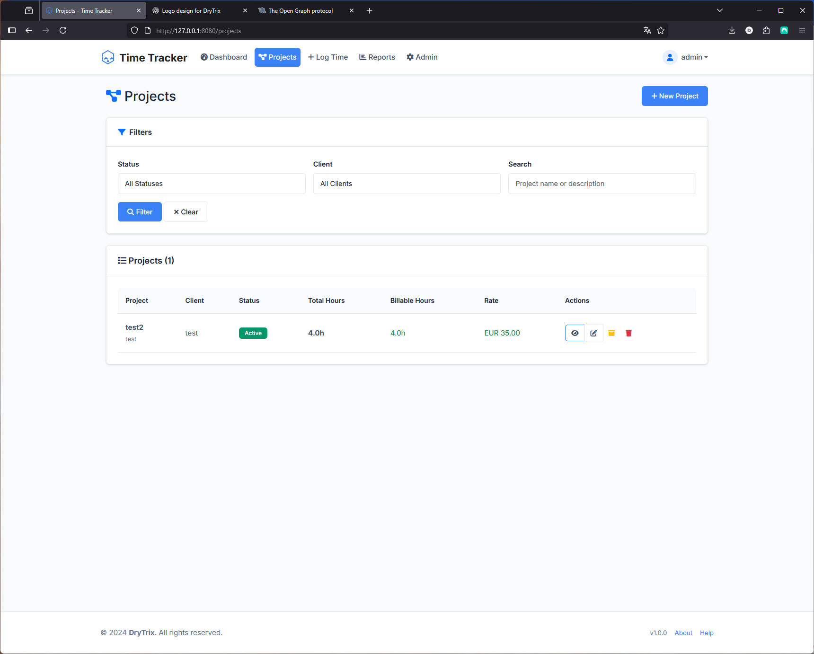
  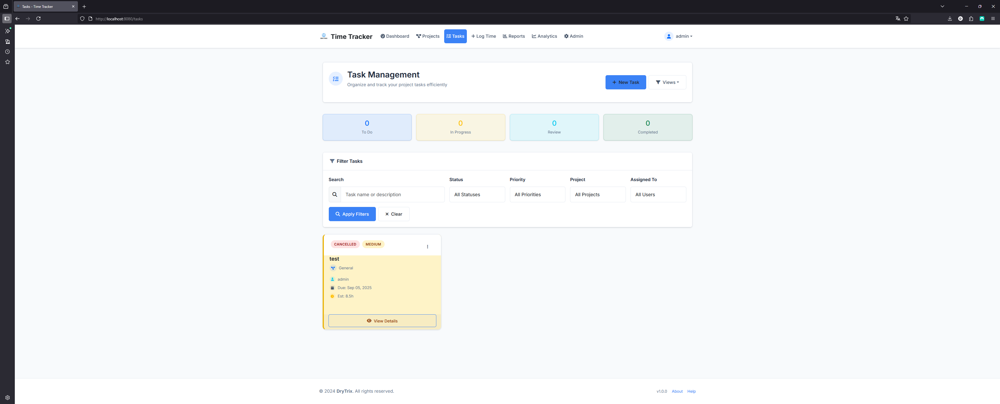
</div>

*Manage multiple projects and break them down into actionable tasks*

---

### Time Tracking — Flexible & Powerful
<div>
  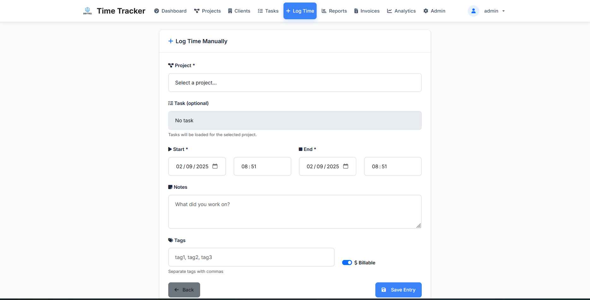
  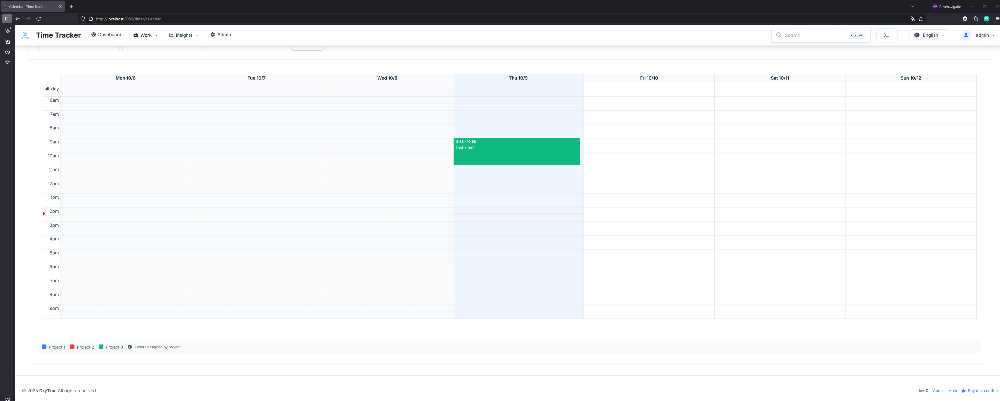
</div>

*Manual time entry and visual calendar view for better planning*

---

### Invoicing & Clients — Professional Billing
<div>
  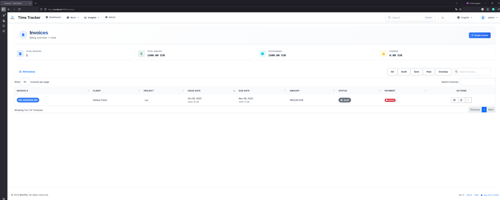
  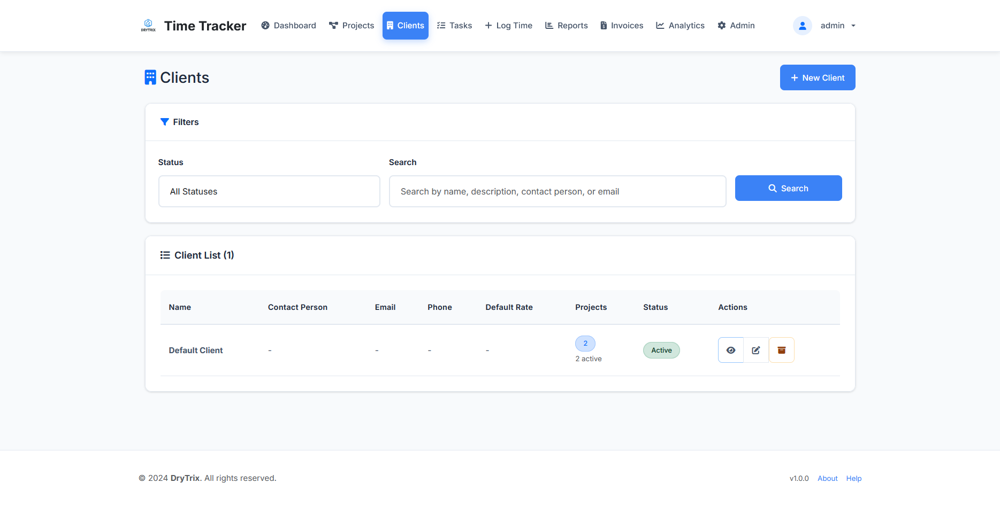
</div>

*Generate invoices from tracked time and manage client relationships*

---

### Reports & Analytics — Data-Driven Insights
<div>
  
  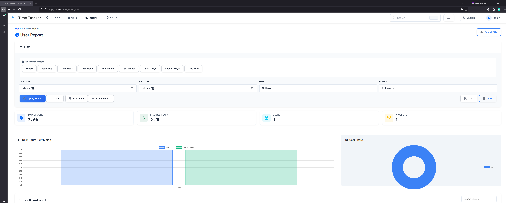
</div>

*Comprehensive reporting and user analytics for informed decisions*

---

### Easy Creation — Streamlined Workflows
<div>
  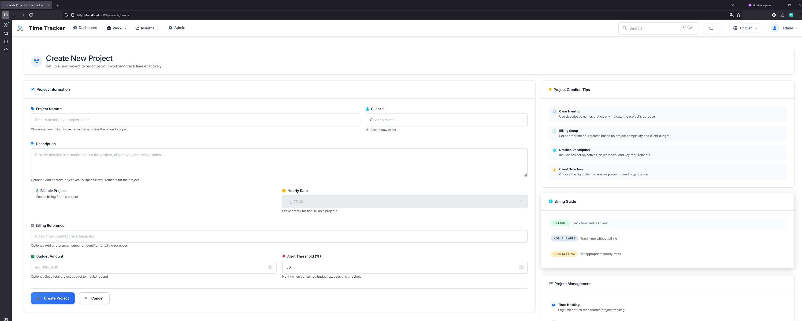
  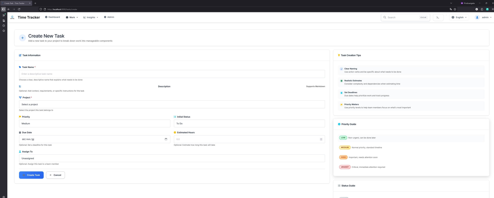
  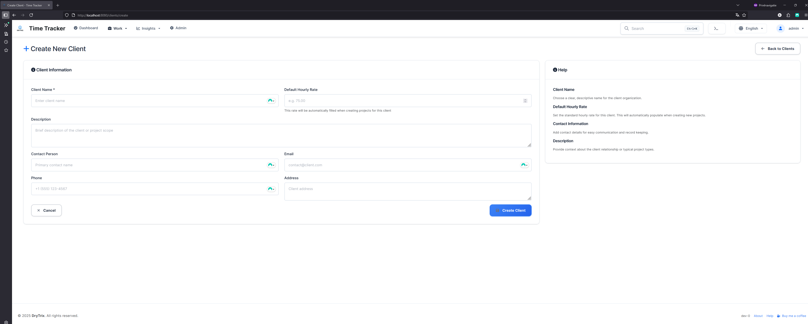
</div>

*Simple, intuitive forms for creating projects, tasks, and clients*

</div>

---

## 🚀 Quick Start

### Docker (Recommended)

Get TimeTracker running in under 2 minutes:

```bash
# Clone the repository
git clone https://github.com/drytrix/TimeTracker.git
cd TimeTracker

# Start with Docker Compose
docker-compose up -d

# Access at http://localhost:8080
```

**First login creates the admin account** — just enter your username!

### Quick Test with SQLite

Want to try it out without setting up a database?

```bash
docker-compose -f docker-compose.local-test.yml up --build
```

No configuration needed — perfect for testing!

---

## 💡 Use Cases

### For Freelancers
Track time across multiple client projects, generate professional invoices, and understand where your time goes. TimeTracker helps you bill accurately and identify your most profitable clients.

### For Teams
Assign tasks, track team productivity, and generate reports for stakeholders. See who's working on what, identify bottlenecks, and optimize team performance.

### For Agencies
Manage multiple clients and projects simultaneously. Track billable hours, generate client invoices, and analyze project profitability — all in one place.

### For Personal Projects
Even if you're not billing anyone, understanding where your time goes is valuable. Track personal projects, hobbies, and learning activities to optimize your time.

---

## 🌟 Why TimeTracker?

| Feature | TimeTracker | Traditional Time Trackers |
|---------|-------------|---------------------------|
| **Self-Hosted** | ✅ Complete data control | ❌ Cloud-only, subscription fees |
| **Open Source** | ✅ Free to use & modify | ❌ Proprietary, locked features |
| **Persistent Timers** | ✅ Runs server-side | ❌ Browser-dependent |
| **Docker Ready** | ✅ Deploy anywhere | ⚠️ Complex setup |
| **Invoicing Built-in** | ✅ Track to bill workflow | ❌ Requires integration |
| **No User Limits** | ✅ Unlimited users | ❌ Per-user pricing |

---

## 📚 Documentation

Comprehensive documentation is available in the [`docs/`](docs/) directory:

### Getting Started
- **[📖 Getting Started Guide](docs/GETTING_STARTED.md)** — Complete beginner's guide (⭐ Start here!)
- **[Installation Guide](docs/DOCKER_PUBLIC_SETUP.md)** — Detailed setup instructions
- **[Requirements](docs/REQUIREMENTS.md)** — System requirements and dependencies
- **[Troubleshooting](docs/DOCKER_STARTUP_TROUBLESHOOTING.md)** — Common issues and solutions
- **[CSRF Token Issues](CSRF_TROUBLESHOOTING.md)** — Fix "CSRF token missing or invalid" errors
- **[CSRF IP Access Fix](CSRF_IP_ACCESS_FIX.md)** — 🔥 Fix cookies not working when accessing via IP address
- **[HTTPS Auto-Setup](README_HTTPS_AUTO.md)** — 🚀 Automatic HTTPS at startup (one command!)
- **[HTTPS Manual Setup (mkcert)](README_HTTPS.md)** — 🔒 Manual HTTPS with no certificate warnings

### Features
- **[Task Management](docs/TASK_MANAGEMENT_README.md)** — Break projects into manageable tasks
- **[Invoice System](docs/INVOICE_FEATURE_README.md)** — Generate professional invoices
- **[Client Management](docs/CLIENT_MANAGEMENT_README.md)** — Manage client relationships
- **[Calendar Features](docs/CALENDAR_FEATURES_README.md)** — Calendar and bulk entry features
- **[Command Palette](docs/COMMAND_PALETTE_USAGE.md)** — Keyboard shortcuts for power users

### Technical Documentation
- **[Project Structure](docs/PROJECT_STRUCTURE.md)** — Codebase architecture
- **[Database Migrations](migrations/README.md)** — Database schema management
- **[Version Management](docs/VERSION_MANAGEMENT.md)** — Release and versioning
- **[CSRF Configuration](docs/CSRF_CONFIGURATION.md)** — Security and CSRF token setup for Docker
- **[CI/CD Documentation](docs/cicd/)** — Continuous integration setup

### Contributing
- **[Contributing Guidelines](docs/CONTRIBUTING.md)** — How to contribute
- **[Code of Conduct](docs/CODE_OF_CONDUCT.md)** — Community standards

---

## 🐳 Deployment

### Local Development
```bash
docker-compose up -d
```

### Production with PostgreSQL
```bash
# Configure your .env file
cp env.example .env
# Edit .env with production settings
# IMPORTANT: Set a secure SECRET_KEY for CSRF tokens and sessions
# Generate one with: python -c "import secrets; print(secrets.token_hex(32))"

# Start with production compose
docker-compose -f docker-compose.remote.yml up -d
```

> **⚠️ Security Note:** Always set a unique `SECRET_KEY` in production! See [CSRF Configuration](docs/CSRF_CONFIGURATION.md) for details.

### Raspberry Pi
TimeTracker runs perfectly on Raspberry Pi 4 (2GB+):
```bash
# Same commands work on ARM architecture
docker-compose up -d
```

**📖 See [Deployment Guide](docs/DOCKER_PUBLIC_SETUP.md) for detailed instructions**

---

## 🔧 Configuration

TimeTracker is highly configurable through environment variables:

```bash
# Timezone and locale
TZ=America/New_York
CURRENCY=USD

# Timer behavior
SINGLE_ACTIVE_TIMER=true
IDLE_TIMEOUT_MINUTES=30
ROUNDING_MINUTES=1

# User management
ADMIN_USERNAMES=admin,manager
ALLOW_SELF_REGISTER=false

# Security (production)
SECRET_KEY=your-secure-random-key
SESSION_COOKIE_SECURE=true
```

**📖 See [Configuration Guide](docs/REQUIREMENTS.md) for all options**

---

## 🛣️ Roadmap

### Planned Features
- 📄 **PDF Invoice Templates** — Professional PDF generation
- 📧 **Email Integration** — Send invoices to clients
- 📱 **Progressive Web App** — Install as mobile app
- 🔄 **Recurring Invoices** — Automate recurring billing
- 🎨 **Custom Themes** — Personalize your interface
- 🔌 **API Extensions** — RESTful API for integrations
- 📊 **Advanced Analytics** — More charts and insights

### Recently Added
- ✅ **Invoice Generation** — Complete invoicing system
- ✅ **Task Management** — Full task tracking and management
- ✅ **Command Palette** — Keyboard-driven navigation
- ✅ **Calendar View** — Visual time entry calendar
- ✅ **Bulk Operations** — Bulk time entry creation

---

## 🤝 Contributing

We welcome contributions! Whether it's:

- 🐛 **Bug Reports** — Help us identify issues
- 💡 **Feature Requests** — Share your ideas
- 📝 **Documentation** — Improve our docs
- 💻 **Code Contributions** — Submit pull requests

**📖 See [Contributing Guidelines](docs/CONTRIBUTING.md) to get started**

---

## 📄 License

TimeTracker is licensed under the **GNU General Public License v3.0**.

This means you can:
- ✅ Use it commercially
- ✅ Modify and adapt it
- ✅ Distribute it
- ✅ Use it privately

**See [LICENSE](LICENSE) for full details**

---

## 🆘 Support

- 📖 **Documentation**: Check the [`docs/`](docs/) directory
- 🐛 **Bug Reports**: [Open an issue](https://github.com/drytrix/TimeTracker/issues)
- 💬 **Discussions**: [GitHub Discussions](https://github.com/drytrix/TimeTracker/discussions)
- 📧 **Contact**: [Create an issue](https://github.com/drytrix/TimeTracker/issues) for support

---

## ⭐ Star Us!

If TimeTracker helps you track your time better, consider giving us a star on GitHub! It helps others discover the project.

<div align="center">

**[⭐ Star on GitHub](https://github.com/drytrix/TimeTracker)**

---

**Built with ❤️ for the time-tracking community**

</div>
